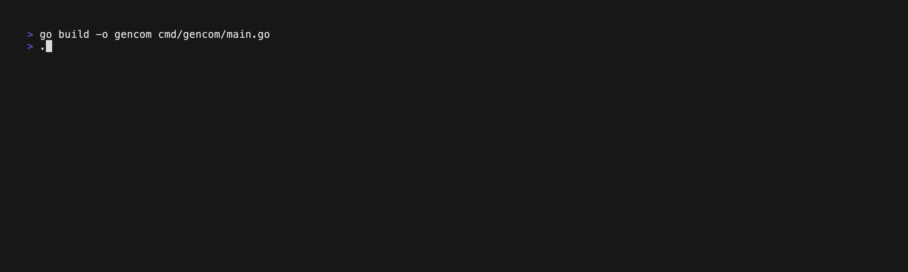

# GenCom

A small tool to generate conventional commits with OpenAI API.

## Usage

GenCom creates a commit message for the currently staged changes
and provides a TUI for the user to edit before committing.


```bash
git add somefile.go
git add someOtherFile.go
gencom
```





## What are Conventional Commits?

> The [Conventional Commits specification](https://www.conventionalcommits.org/en/v1.0.0/) is a lightweight convention on top of commit messages. It provides an easy set of rules for creating an explicit commit history; which makes it easier to write automated tools on top of. This convention dovetails with SemVer, by describing the features, fixes, and breaking changes made in commit messages.
>
>The commit message should be structured as follows:
>
> ```
> <type>[optional scope]: <description>
> 
> [optional body]
> 
> [optional footer(s)]
> ```

